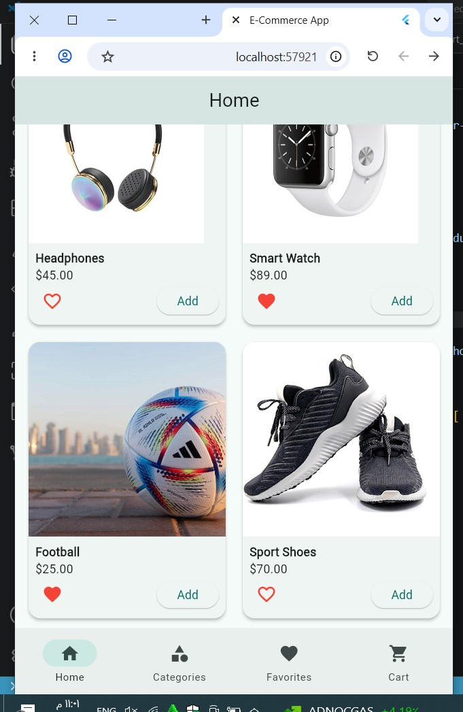
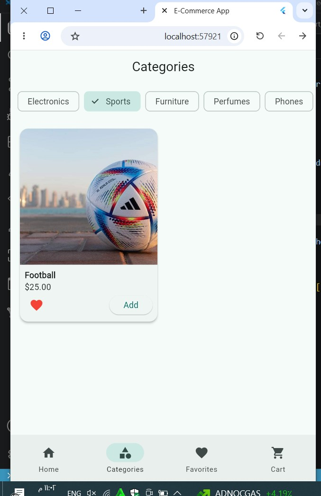
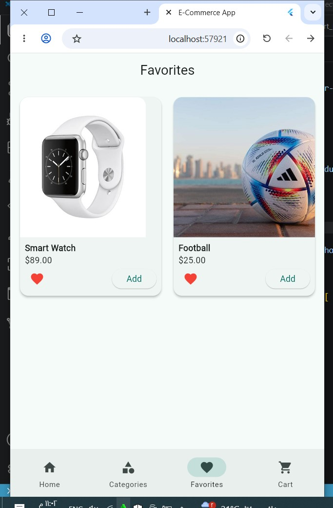
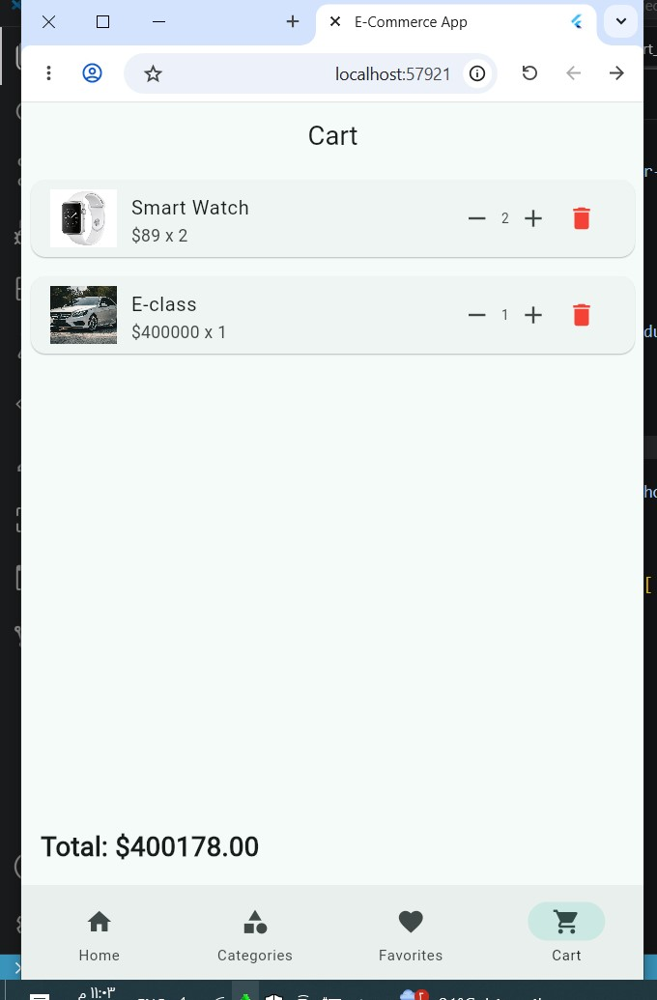

# E-Commerce App with Provider

A Flutter e-commerce application using Provider for state management.

---

## Project Description

This project is a multi-screen shopping app that allows users to browse products, filter products by category, add products to favorites, and manage a shopping cart.

The app uses Provider to manage shared state between screens.

---

## Technologies Used

- Flutter
- Dart
- Provider
- Material Design

---

## Screenshots

### Home Screen

### Categories Screen

### Favorites Screen

### Cart Screen

---

## Features

- Product list display
- Product images
- Product categories
- Filter products by category
- Add and remove favorites
- Add products to cart
- Increase and decrease cart quantity
- Remove products from cart
- Calculate total price
- Bottom navigation bar
- Provider state management

---

## App Screens

### Home Screen

Displays all available products in a grid layout.

### Categories Screen

Allows filtering products based on selected category.

### Favorites Screen

Displays only the products marked as favorites.

### Cart Screen

Displays cart items, quantities, remove button, and total price.

---

## State Management

This app uses Provider with ChangeNotifier.

### Providers Used

- CartProvider
- FavoriteProvider

---

## Project Structure

`text
lib/
├── main.dart
├── models/
│   └── product.dart
├── providers/
│   ├── cart_provider.dart
│   └── favorite_provider.dart
├── screens/
│   ├── home_screen.dart
│   ├── categories_screen.dart
│   ├── favorites_screen.dart
│   └── cart_screen.dart
└── widgets/
    └── product_card.dart

## Author
Husam Dirhem